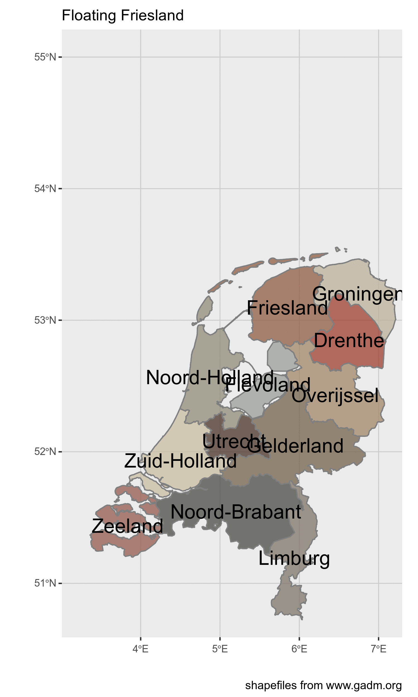

[](http://www.repostatus.org/#concept)

In this project I'm trying to answer the question:

> could we dig up Friesland (or any other Dutch province) and float it away?




You might think: "Where did you get that ridiculous idea from?".

Friesland is one of the provinces of the Netherlands. 
The Frisians have a distinct culture and ((inter)nationally recognized ) language. 
So Frisian is a language in schools, all the roadsigns are in two languages etc.
Every once in a while when the newspapers have nothing else to record they will try to sensationalize news from 
Friesland. And sometimes that leads to someone commenting: "why don't we just dig the province out and float it away?" [1].

And although the idea is ridiculous, it got me thinking...

Can it be done? Can we lift up an entire province and move it away? How expensive would it be? 

So today we will determine:

- Can we dig away and float an entire province
- how long would it take and how much would it cost?
- if we don't float it away, can we make a mountain for skiing?


[1]: It's better in Dutch: "waarom steken we die provincie niet gewoon af en laten we die wegdrijven?"


```{r setup, include=FALSE}
knitr::opts_chunk$set(echo = TRUE)
```


```{r, eval = FALSE}
library(tidyverse)
library(sf)
library(magick)
```

## simplest case

Use the total area of the province is 3.341,70 km2 but according to the english wikipedia it is
different: 3,250 km2 

I will assume the ground is flat (because the country is really flat, also it is quite difficult to take height into account)

We will just dig everything away. 

### total volume of ground 
Let us just assume everything is flat, or if it issn't we are very precise in digging it up. 
we dig down 5 meters (don't know why)
if we dig up 5 meters below the ground we need to move  0.016705 km^3 (cubic kilometers) 
which according to wolfram alpha is  ≈ 0.61 × volume of concrete used in the construction of the Three Gorges Dam (≈ 2.72×10^7 m^3 )

0.016705 * 10 e9 = 16 705 000 m3
km^3 = 1 000 000 000 m3


## Only Friesland?  
No of course we can also float other provinces away


