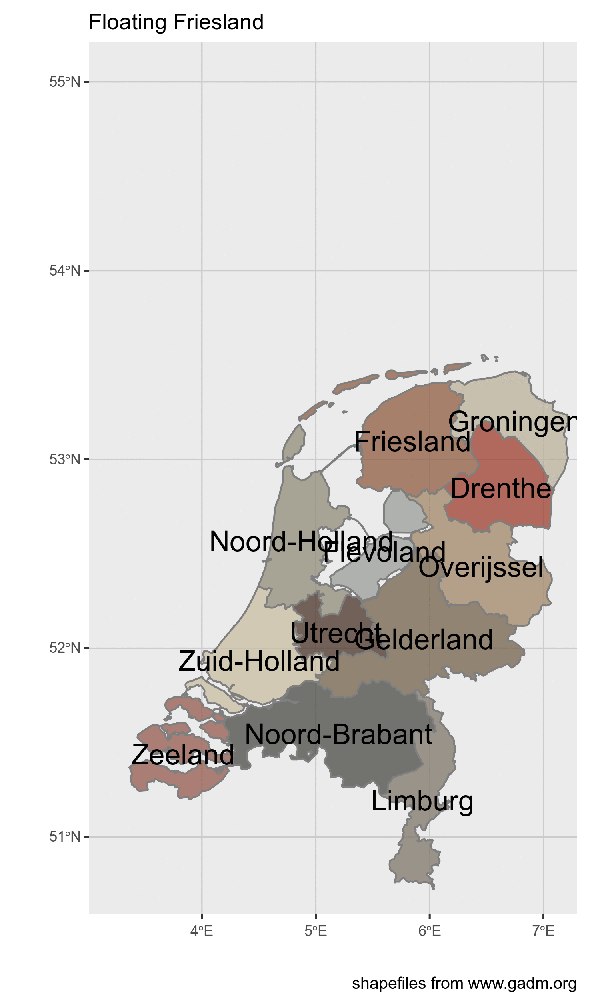
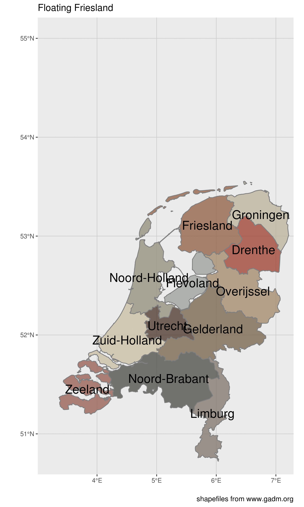

Floating Friesland
================
Roel M. Hogervorst
January 17, 2018

In this project I'm trying to answer the question:

> could we dig up Friesland (or any other Dutch province) and float it away?



You might think: "Where did you get that ridiculous idea from?".

Friesland is one of the provinces of the Netherlands. The Frisians have a distinct culture and ((inter)nationally recognized ) language. So Frisian is a language in schools, all the roadsigns are in two languages etc. Every once in a while when the newspapers have nothing else to record they will try to sensationalize news from Friesland. And sometimes that leads to someone commenting: "why don't we just dig the province out and float it away?" [1](It's%20better%20in%20Dutch: "waarom steken we die provincie niet gewoon af en laten we die wegdrijven?").

And although the idea is ridiculous, it got me thinking...

Can it be done?

So today we will determine:

-   Can we dig away and float an entire province
-   how long would it take and how much would it cost?
-   if we don't float it away, can we make a mountain for skiing?

``` r
library(tidyverse)
library(sf)
library(magick)
```

simplest case
-------------

Use the total area of the province is 3.341,70 km2 but according to the english wikipedia it is different: 3,250 km2

I will assume the ground is flat (because the country is really flat, also it is quite difficult to take height into account)

We will just dig everything away.

### total volume of ground

Let us just assume

Only Friesland?
---------------

No of course we can also float other provinces away


